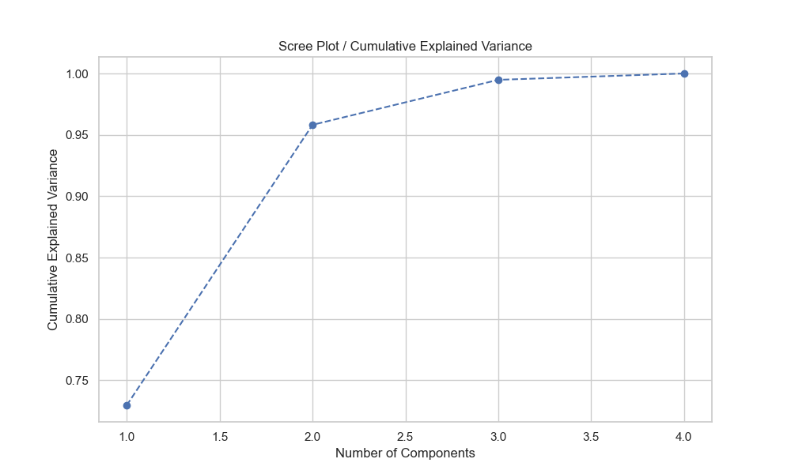
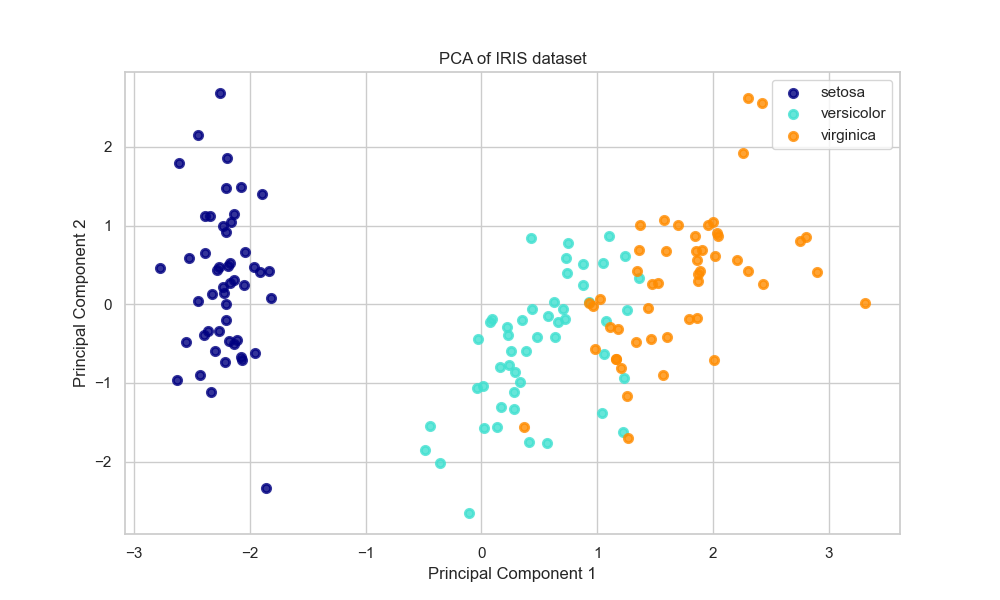

# LAB ASSIGNMENT-11

**Title:** Dimensionality Reduction using Principal Component Analysis (PCA)

**Objective:** The objective of this lab assignment is to implement Dimensionality Reduction using Principal Component Analysis (PCA) and gain hands-on experience in reducing the dimensionality of a dataset while preserving its essential information.

---

## 1. Introduction to PCA

Principal Component Analysis (PCA) is a statistical procedure that uses an orthogonal transformation to convert a set of observations of possibly correlated variables into a set of values of linearly uncorrelated variables called principal components. It is widely used for dimensionality reduction, visualization, and noise reduction.

**Key Steps in PCA:**
1.  **Standardization:** Scaling data to have mean 0 and variance 1.
2.  **Covariance Matrix Computation:** Understanding how variables vary together.
3.  **Eigenvalue Decomposition:** Finding eigenvectors (directions) and eigenvalues (magnitude of variance).
4.  **Feature Vector Creation:** Choosing top $k$ eigenvectors.
5.  **Recasting Data:** Projecting original data onto the new axes.

---

## 2. Implementation

We utilized the **Iris dataset**, a classic dataset for pattern recognition.
- **Features:** Sepal Length, Sepal Width, Petal Length, Petal Width (4 dimensions).
- **Target:** Species (Setosa, Versicolor, Virginica).

### Step 1 & 2: Data Loading and Standardization
We used `StandardScaler` from `scikit-learn` to standardize the features. This is crucial because PCA is sensitive to the scale of the data.

```python
# Code Snippet: Standardization
scaler = StandardScaler()
X_std = scaler.fit_transform(X)
```

### Step 3: Determining Number of Components
We computed the explained variance ratio for each component.

**Results:**
- **PC1:** 72.96% variance
- **PC2:** 22.85% variance
- **PC3:** 3.67% variance
- **PC4:** 0.52% variance

**Cumulative Variance:**
- 1 Component: 72.96%
- **2 Components: 95.81%**

Since 2 components capture over 95% of the information, we selected **k=2**.

**Scree Plot:**


### Step 4 & 5: Applying PCA and Visualization
We transformed the 4D data into 2D space.

```python
# Code Snippet: PCA Application
pca = PCA(n_components=2)
X_pca = pca.fit_transform(X_std)
```

**PCA Visualization:**

*Figure: The data is well-separated in the reduced 2D space, maintaining the cluster structure of the species.*

---

## 3. Performance Evaluation

We evaluated the impact of dimensionality reduction by training a Logistic Regression classifier on both the original (4D) and reduced (2D) datasets.

| Metric | Original Data (4 Features) | PCA Reduced Data (2 Features) |
| :--- | :--- | :--- |
| **Accuracy** | **1.0000** | **0.9111** |
| **Training Time** | 0.0035s | 0.0010s |

**Interpretation:**
While the accuracy dropped slightly (from 100% to ~91%), the dimensionality was reduced by 50%. In larger datasets, this trade-off often results in significantly faster training times and reduced risk of overfitting, despite a small loss in information.

---

## 4. Use Cases of PCA

1.  **Image Compression:** Reducing the number of pixels/features while maintaining the image structure (e.g., Eigenfaces).
2.  **Visualization:** Projecting high-dimensional data (genes, financial metrics) into 2D/3D for visual inspection.
3.  **Preprocessing for Machine Learning:** Removing multicollinearity and reducing the "curse of dimensionality" to improve model performance and speed.
4.  **Noise Filtering:** Reconstructing data using only top components to remove noise captured by lower components.

---

## Conclusion

In this assignment, we successfully implemented PCA on the Iris dataset. We demonstrated that we could reduce the dataset from 4 dimensions to 2 while retaining **95.8%** of the variance. The visualization confirmed that the class separability was largely preserved, validating PCA as an effective tool for dimensionality reduction.
