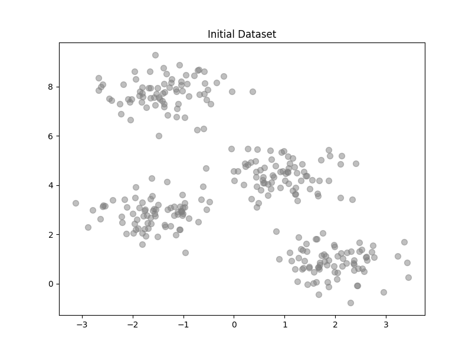
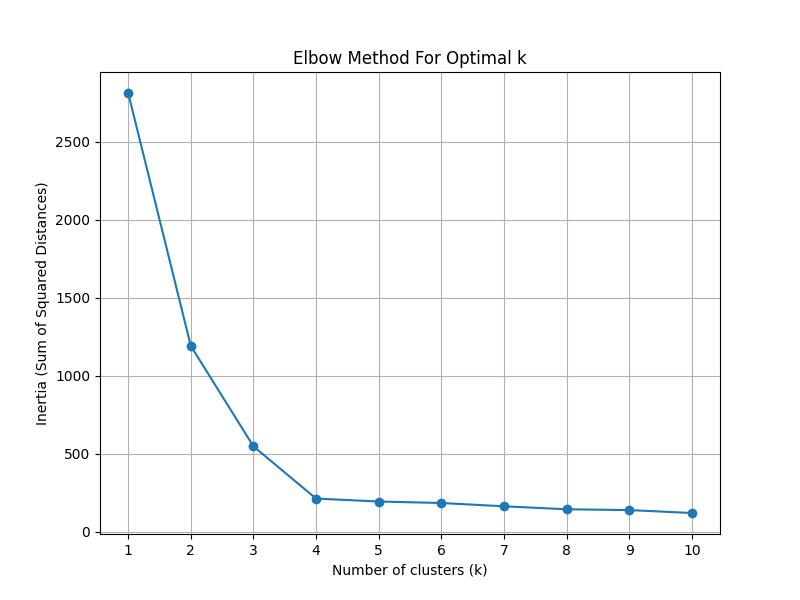
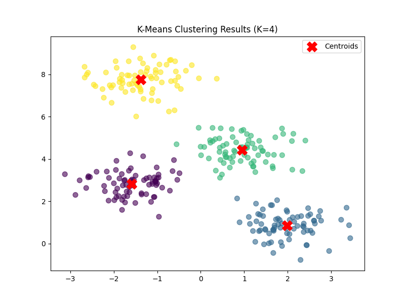

# LAB ASSIGNMENT-9

**Title:** Write a python program to implement K-Means clustering Algorithm.

**Objective:** The objective of this lab assignment is to implement the K-Means clustering algorithm from scratch in Python and gain a deep understanding of how the algorithm works.

---

## 1. Introduction to K-Means Clustering

K-Means is an unsupervised learning algorithm that groups data points into $k$ distinct clusters. The algorithm aims to minimize the within-cluster sum of squared distances (inertia).

**Algorithm Steps:**
1.  **k initial "means" (centroids)** are generated at random.
2.  **Assignment Step:** Each observation is assigned to the nearest centroid.
3.  **Update Step:** The centroids are recalculated as the mean of all points assigned to that cluster.
4.  The steps repeat until convergence (centroids stop moving) or a maximum number of iterations is reached.

---

## 2. Implementation from Scratch

We implemented a custom class `KMeansScratch` in Python without relying on `sklearn.cluster`.

### Key Code Segments

**1. Euclidean Distance Calculation:**
```python
def euclidean_distance(self, a, b):
    return np.sqrt(np.sum((a - b)**2))
```

**2. The Iterative Loop (Fit):**
```python
for _ in range(self.max_iters):
    # Assign clusters
    clusters = [[] for _ in range(self.k)]
    for point in X:
        distances = [self.euclidean_distance(point, centroid) for centroid in self.centroids]
        closest_centroid_index = np.argmin(distances)
        clusters[closest_centroid_index].append(point)
    
    # Update centroids
    for i in range(self.k):
        if clusters[i]:
            self.centroids[i] = np.mean(clusters[i], axis=0)
```

---

## 3. Results and Visualizations

We utilized a synthetic dataset generated using `make_blobs` with 4 distinct centers.

### 3.1 Dataset Initialization
The dataset consists of 300 points.



### 3.2 Finding Optimal K (Elbow Method)
To determine the best value for $K$, we plotted the **Inertia** (sum of squared distances) for $K=1$ to $10$.


*Observation: The "elbow" clearly appears at $K=4$, suggesting that 4 is the optimal number of clusters for this dataset.*

### 3.3 Final Clustering (K=4)
Running the algorithm with $K=4$ produced the following result:


*Observation: The algorithm successfully identified the 4 natural clusters (colored points) and their centroids (red X markers).*

---

## 4. Conclusion

In this lab, we successfully implemented the K-Means algorithm from scratch. By manually calculating distances and updating centroids, we verified the core mechanics of the algorithm. The Elbow Method correctly identified $K=4$ as the optimal number of clusters, matching the ground truth of our synthetic dataset.
